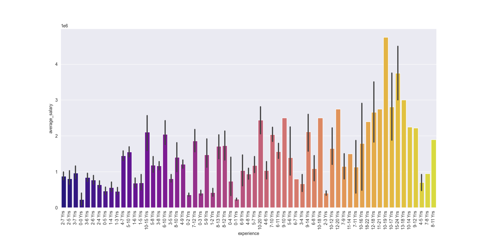
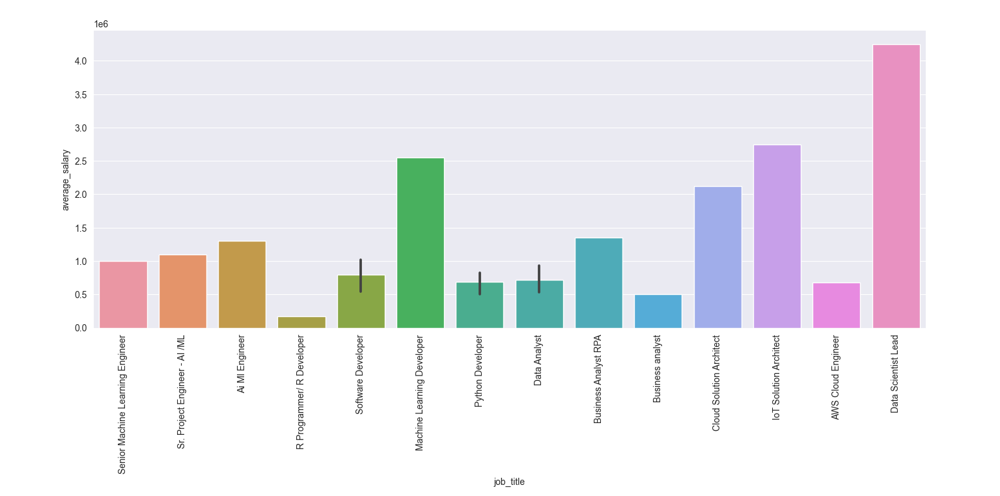

## Naukri-datascrapper

The main purposes of conducting a job analysis process are to use this particular information to create a right fit between job and employee, to assess the performance of an employee, to determine the worth of a particular task, and to analyse training and development needs of an employee delivering that specific job. Naukri.com helps people understand the skills they need to attain or at least have a basic understanding of.

## Project setup

using ANACONDA
conda create -n recreated_env --file dpdm.yml 

## Graphs

